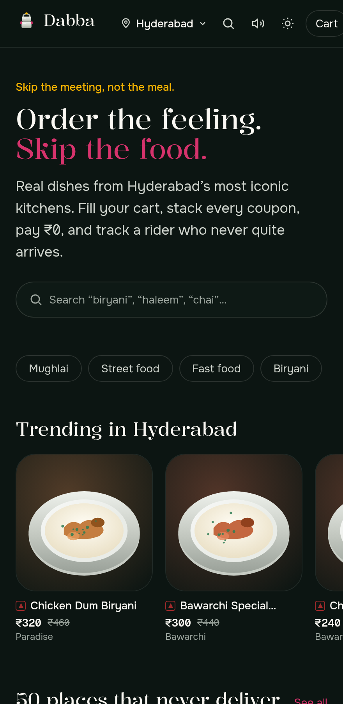
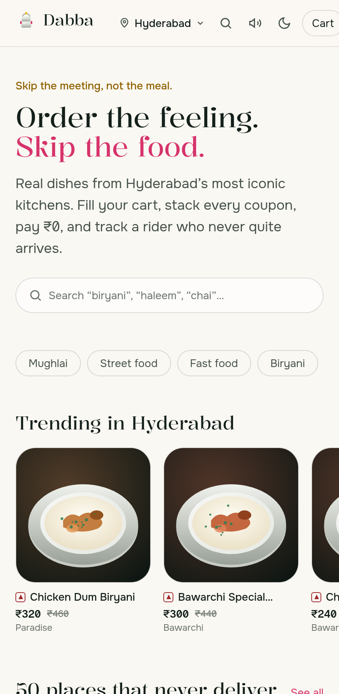
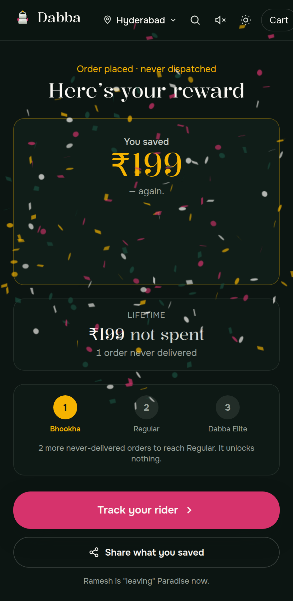
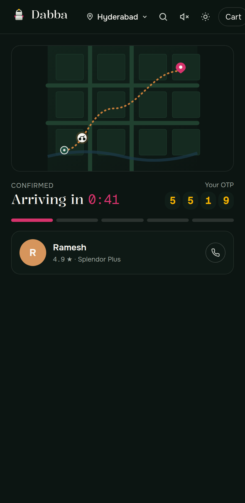

# Dabba Never Comes

**Order the feeling. Skip the food.**

A dopamine web app disguised as an Indian food-delivery app. You browse *real* dishes from India's
most iconic restaurants, customise them, fill a cart, watch the bill climb, stack every coupon,
"pay" ₹0 over UPI, scratch a reward card, and track a rider named Ramesh who is always *bahar* and
never quite arrives. Nothing is charged. No account, no card, no backend. The dabba (*tiffin box*)
never comes — that's the point.

<p align="center">
  
</p>

<table>
  <tr>
    <td width="33%"></td>
    <td width="33%"></td>
    <td width="33%"></td>
  </tr>
  <tr>
    <td align="center"><em>Light &amp; dark themes</em></td>
    <td align="center"><em>The reward you didn't earn</em></td>
    <td align="center"><em>Ramesh, forever <em>bahar</em></em></td>
  </tr>
</table>

> A parody. No affiliation with any restaurant. No real food, no real payment, no real charge.

---

## The eight-beat loop

Craving → the hunt → customise → fill the cart → **discount theatre** → **the UPI moment** →
**reward (scratch card)** → **track, then the twist ("Delivered ✅")** — and it loops (reorder,
order history, a shareable receipt). A stranger can go from landing to "Delivered" in under a
minute, with no instructions, and the parody lands in about five seconds without a banner.

## What's inside

- **14 cities · 86 real restaurants · ~415 hand-written dishes**, web-verified, with food-writer
  copy and correct veg / Jain / no-onion-garlic flags — topped up to **~50 places per city** with
  clearly-labelled *fictional cloud kitchens* so every city feels full.
- **A real purchase high, faithfully mimicked**: dish customisation with live re-pricing, a
  "Deliver to" address flow, a coupon drawer where every coupon works *and stacks*, a bill that
  always resolves to ₹0, a UPI pay sequence with a success chime and haptics, a canvas scratch
  card, confetti, a loyalty tier ladder that unlocks nothing, and a hand-drawn tracking map with a
  scooter that eases along the route toward a delivery that never lands.
- **Light &amp; dark themes** with a header toggle (system-aware, no flash of the wrong theme).
- **Installable PWA** — offline shell, service worker, manifest, install prompt — and dynamic
  share/OG cards ("I saved ₹X today by ordering nothing").

## Stack

- **Next.js 16** (App Router) · **TypeScript** · **Tailwind v4** — **Vercel-ready** (zero config to enter)
- **Zustand + persist** (localStorage) — cart, orders, savings, settings. No backend / DB / auth.
- **Framer Motion** (sheets &amp; springs, lazy-loaded), **canvas-confetti**, a `<canvas>` scratch card
- Hand-drawn **SVG map** with a `getPointAtLength()` scooter — no Google Maps, no API key
- Typed data under `src/data`, **zod**-validated at build (a bad reference fails `next build`)

## Design — "Steel Thali"

Deep banana-leaf green + bandhani hot pink, rooted in Indian textile and mithai-box colour, on an
ink ground — with **turmeric reserved *only* for money-saved moments**. Display type is **Kalnia**;
Devanagari is **Tiro Devanagari Hindi**; body is **Onest**; every price, OTP, and countdown is set
in tabular **Geist Mono** so numbers tick instead of reflowing. Full rationale in
[`docs/design.md`](docs/design.md).

## Content &amp; constraints

- **Dish art is original illustration** (generated SVG), not photography — the build environment's
  egress policy blocks image hosts, and illustrations keep the app tiny, theme-aware, and free of
  attribution/licensing risk. `DishImage` is the single swap point if photos ever become available.
- Restaurant names are used **descriptively and factually** to identify well-known, real places; no
  logos, brand colours, or trademarks are reproduced, and no affiliation is implied or exists.
  Everything else is a fictional cloud kitchen. See `/credits` and the `/contact` takedown route.

## Quality

Lighthouse (mobile preset, median of 3 runs) clears **Accessibility, Best-Practices and SEO ≥ 95 on
every route** (Best-Practices &amp; SEO score 100). Performance is app-side optimised — Framer Motion
is lazy-loaded out of the first-load bundle, one static display-font weight is preloaded, dish art is
inline data-URI SVG decoded off the main thread, the menu's veg filter is CSS-only, and there are
zero external network requests — and is otherwise dominated by run-to-run LCP variance in the shared
CI sandbox; authoritative numbers want a run on real infra. The audit is reproducible with
`npm run audit` (see below).

## Run it locally

```bash
npm install
npm run dev        # http://localhost:3000
npm run build      # production build (zod-validates all data)
npm run audit      # Lighthouse, median of 3 runs — needs a running production server
```
